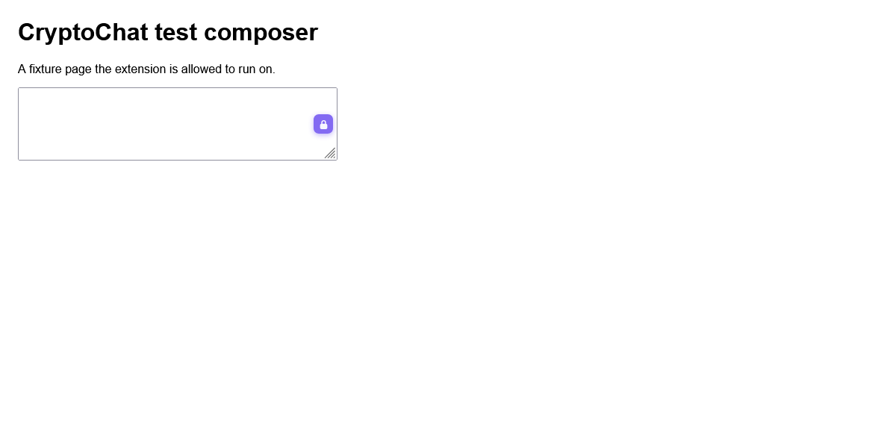
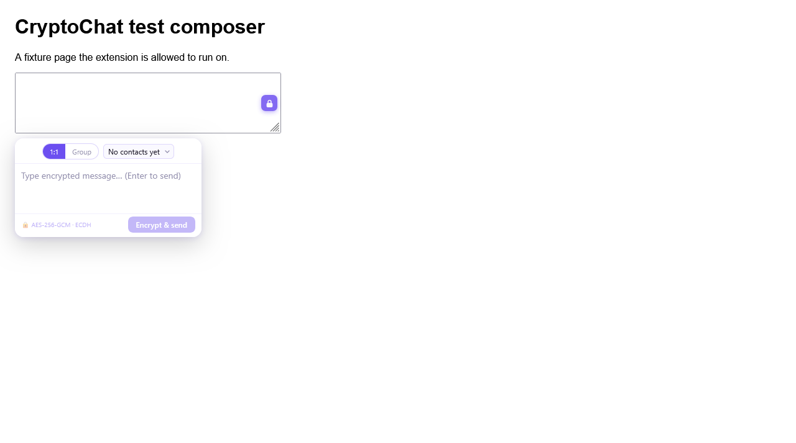
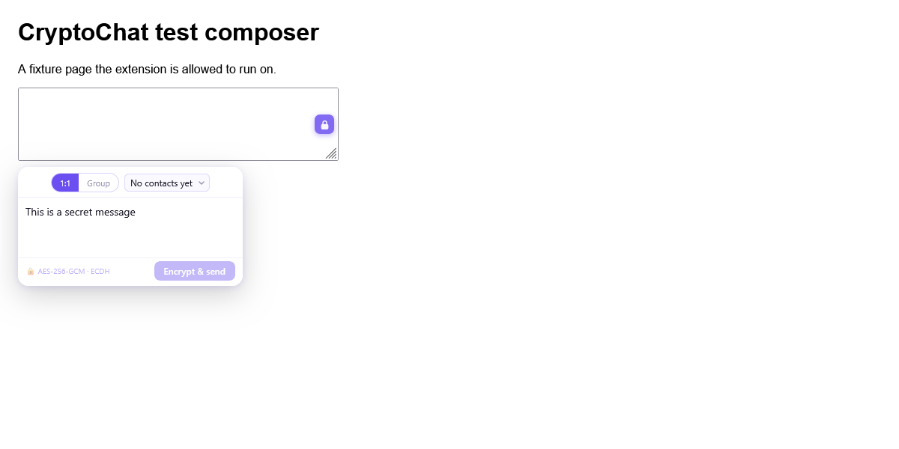

# CryptoChat

> End-to-end encrypted messaging layered on top of the sites you already use — Discord, Slack, WhatsApp Web, Telegram Web, Instagram DMs, X/Twitter, and Facebook Messenger — without any of those platforms ever seeing your plaintext.

Works in **Chrome, Brave, Edge, Firefox, and LibreWolf**. No accounts, no servers. All cryptography runs in your browser using the native Web Crypto API.

---

## Features

- **One lock button per message box.** When a site is enabled, CryptoChat detects its input boxes and overlays a small lock button directly on them. Click it to compose; the ciphertext is injected into that same box and sent.
- **1:1 and group encryption.** Classical ECDH + AES-256-GCM, with an optional post-quantum hybrid mode.
- **Reads inline.** Encrypted messages in any feed are auto-detected and decrypted in place; unknown senders get a click-to-decrypt overlay.
- **Native + GPG keys.** Import a CryptoChat public key, or a Kleopatra/GnuPG armored ECC key.
- **Share links.** Generate a link that adds you as a contact in one click.
- **Encrypted backups.** Move your identity and contacts between browsers with a passphrase-protected `.ccbackup` file.
- **Optional any-site mode (Firefox/LibreWolf).** Not on the supported list? Grant access and CryptoChat works on any site with a text input. The Chrome build stays lean and requests only the seven platform hosts.

---

## Screenshots

The lock button attaches to detected message boxes; clicking it opens the composer.







*Captured automatically by `npm run test:screenshots`, which drives LibreWolf through Selenium/geckodriver — see [Testing](#testing).*

---

## How it works

```
You click the lock on a message box
        ↓
Message encrypted locally (AES-256-GCM; ECDH, + ML-KEM-768 in hybrid mode)
        ↓
Ciphertext injected into the platform's message input
        ↓
You hit send — the platform sees and stores only ciphertext
        ↓
Recipient's feed:  [🔒 Encrypted message — click to decrypt]
        ↓
Click → decrypted locally in their browser → plaintext shown inline
```

Keys are generated in the browser and stored in `chrome.storage.local`. They never leave your device.

---

## Supported sites

CryptoChat ships adapters for these hosts. Each adapter declares the input/send/message selectors for that site (see [`src/adapters/`](chrome/src/adapters)).

| Site | Composer | Host(s) |
|---|---|---|
| Discord | Slate.js editor | `discord.com` |
| Slack | Quill editor | `*.slack.com`, `app.slack.com` |
| WhatsApp Web | contenteditable | `web.whatsapp.com` |
| Telegram Web | contenteditable | `web.telegram.org` |
| Instagram DMs | Lexical editor | `www.instagram.com` |
| X / Twitter | React contenteditable | `x.com`, `twitter.com` |
| Facebook Messenger | Draft.js editor | `www.facebook.com`, `www.messenger.com` |

**Any-site mode (Firefox/LibreWolf):** enable *Settings → Enable on all sites* in the popup. CryptoChat requests access to all sites and registers its generic detector for pages that don't have a dedicated adapter. The Chrome build omits this feature so it requests no broad host permissions, and runs on the seven supported platforms only.

---

## Crypto

All operations use the browser's built-in **Web Crypto API** (`SubtleCrypto`). There are no runtime crypto dependencies. The optional post-quantum bundle is built from the [`mlkem`](https://www.npmjs.com/package/mlkem) package (build-time only).

| Layer | Algorithm | Details |
|---|---|---|
| Key exchange | ECDH P-256 | One keypair per identity, stored locally |
| 1:1 encryption | AES-256-GCM | Random 96-bit IV per message |
| Group encryption | AES-256-GCM + AES-KW | Random DEK per message, wrapped per recipient |
| Hybrid (PQC) | ECDH P-256 + ML-KEM-768 → HKDF-SHA256 | `CRYPTOCHAT_V2` / `CRYPTOCHAT_GRPV2` |
| GPG bridge | PGP packet parser → SPKI | ECC P-256/P-384/P-521 bridged to SubtleCrypto |
| Native fingerprint | SHA-256 of SPKI | Shown in the UI for out-of-band verification |
| GPG fingerprint | OpenPGP v4 (SHA-1) / v5 (SHA-256) | Matches GnuPG/Kleopatra |

### Wire formats

Every encrypted message is plain text any platform can transmit as a normal chat message.

**1:1 (classical):**
```
CRYPTOCHAT_V1:<b64_iv>:<b64_ciphertext>:<b64_senderPubKey>
```

**1:1 (hybrid PQC):**
```
CRYPTOCHAT_V2:<b64_iv>:<b64_ciphertext>:<b64_senderEcdhPub>:<b64_mlkemCt>
```

**Group (classical):**
```
CRYPTOCHAT_GRP_V1:<b64_msgId>:<b64_iv>:<b64_encBody>:<b64_slotsJson>
```

**Group (hybrid PQC):**
```
CRYPTOCHAT_GRPV2:<b64_msgId>:<b64_iv>:<b64_encBody>:<b64_slotsJson>
```

In the classical group format, `slotsJson` is `[{ h: handle, p: recipientPubKeyB64, dek: wrappedDEK }]`. The body is encrypted once with a random Data Encryption Key (DEK); each slot wraps that DEK for one recipient with their ECDH-derived AES-KW key.

In the hybrid formats, each slot carries the recipient's ECDH key, an ML-KEM ciphertext, and the wrapped DEK. The hybrid key is `HKDF-SHA256(ECDH_secret || ML-KEM_secret)`, with both public keys and the ML-KEM ciphertext bound into the KDF context. An attacker must break **both** ECDH and ML-KEM to recover a message.

### Post-quantum mode

This repository ships the generated ML-KEM-768 bundle (`src/vendor/mlkem768.js`), so hybrid V2 is **enabled by default**. New identities automatically get an ML-KEM-768 key, and messages upgrade to V2 whenever both parties advertise one. Existing V1 messages keep working.

To regenerate the bundle (for example after updating the `mlkem` package):

```bash
npm install
npm run build:pqc     # rebundles mlkem into src/vendor/mlkem768.js
npm run build         # rebuild both packages
```

To build a classical-only (V1) package, delete `src/vendor/mlkem768.js`; `background-loader.js` falls back to the stub automatically.

---

## Project structure

```
cryptochat-extension/
├── package.json                 # dev tooling (esbuild, archiver, mlkem) — no runtime deps
├── index.html                   # GitHub Pages landing page (served from repo root)
├── privacy.html                 # privacy policy (linked from the stores)
├── chrome/                      # Chrome / Brave / Edge package (MV3, service_worker)
│   ├── manifest.json
│   ├── build.js                 # pack chrome/dist/cryptochat-chrome.zip
│   └── src/
│       ├── background-loader.js # importScripts() entry (vendor stub + bundle)
│       ├── background-bundle.js # ★ GENERATED — engine + keystore + handler
│       ├── background/          # handler.js + index.js (source)
│       ├── crypto/
│       │   ├── engine.js        # ECDH, AES-GCM, group, hybrid PQC, GPG parser
│       │   └── keystore.js      # identity + contact persistence
│       ├── adapters/            # per-site input/send/message selectors
│       ├── content.js           # input detection, overlay UI, feed decryption
│       ├── vendor/              # mlkem768.js (ML-KEM-768 bundle) + stub fallback
│       └── ui/                  # popup.html / popup.css / popup.js
├── mozilla/                     # Firefox / LibreWolf package (identical runtime; scripts[] manifest)
├── scripts/                     # bundle / sync / pack / PQC build + LibreWolf helpers
├── test/                        # Node crypto round-trip + handler tests
│   └── e2e/                     # Selenium smoke test (launches LibreWolf)
├── assets/screenshots/          # README screenshots (generated by test:screenshots)
├── store/                       # store submission assets
│   ├── listing.md               # Chrome Web Store + AMO copy
│   └── screenshots/             # Chrome Web Store images (24-bit PNG + JPEG)
├── web-ext-config.mjs           # web-ext lint/run config
└── THIRD_PARTY_LICENSES.md
```

Both browser directories are independently loadable. Their runtime code is identical — only `manifest.json` differs. `mozilla/build.js` syncs the shared runtime from `chrome/` before packing so the two can never drift.

**Why a generated bundle?** ES-module service workers work in Chrome but are unreliable in Firefox MV3. `background-bundle.js` is a single classic (non-module) IIFE built from the ES-module sources via esbuild, loaded with `importScripts()`.

---

## Install

Requires Node.js only for building. The extension itself has no runtime dependencies.

```bash
git clone https://github.com/retiredroca/ciphertext.git
cd CryptoChat
npm install
npm run build          # bundles + packs both browsers
```

### Chrome / Brave / Edge

1. Open `chrome://extensions/`
2. Enable **Developer mode**
3. **Load unpacked** → select the `chrome/` folder

### Firefox / LibreWolf (temporary)

1. Open `about:debugging` → **This Firefox** (or **This LibreWolf**)
2. **Load Temporary Add-on…** → select `mozilla/manifest.json`

### Firefox / LibreWolf (persistent)

Build the `.xpi` and either drag it onto a build with signature enforcement disabled (`xpinstall.signatures.required = false`) or sign it for free via [addons.mozilla.org](https://addons.mozilla.org) ("On your own", unlisted).

```bash
npm run build:firefox
# → mozilla/dist/cryptochat-firefox.xpi
```

### Build & test commands

```bash
npm run bundle         # regenerate background-bundle.js from source modules
npm run build:chrome   # chrome/dist/cryptochat-chrome.zip
npm run build:firefox  # sync chrome → mozilla, then mozilla/dist/cryptochat-firefox.xpi
npm run build          # both
npm run build:pqc      # regenerate the ML-KEM-768 hybrid bundle
npm test               # crypto round-trip + handler unit tests (Node)
npm run test:e2e       # Selenium smoke test in LibreWolf
npm run test:screenshots # drive LibreWolf and refresh assets/screenshots
npm run screenshots:store # write 24-bit 1280x800 / 640x400 store images
npm run lint:firefox   # web-ext lint against AMO rules
npm run run:librewolf  # launch LibreWolf with the extension loaded (hot reload)
```

### Testing

- **Unit tests** (`npm test`) run the real crypto engine and background handler under
  Node's WebCrypto + the `mlkem` package: V1 and V2 (hybrid) 1:1 and group round
  trips, tamper rejection, GPG fingerprints, contact CRUD, and the encrypted
  backup export/import (including ML-KEM key preservation). No browser required.
- **End-to-end** (`npm run test:e2e`) drives LibreWolf through geckodriver and
  Selenium. It installs a test copy of the extension whose manifest also matches a
  local fixture page, then asserts the input overlay is injected, the Shadow DOM
  panel opens, and the background responds. Firefox/Marionette blocks WebDriver
  navigation to `moz-extension://` pages, so the popup itself is covered by the
  unit tests plus manual checks.
- **Browser resolution:** `scripts/lib/librewolf.js` finds LibreWolf at the usual
  install paths; override with `LIBREWOLF_PATH`, and `GECKODRIVER_PATH` for
  geckodriver. Set `CC_E2E_HEADLESS=1` for headless.

  ```bash
  scoop install nodejs geckodriver   # Windows
  npm install
  npm run build:firefox
  npm run test:e2e
  ```

- **Chrome Web Store images:** `npm run screenshots:store` converts the captures
  into submission-ready images under `store/screenshots/` — 24-bit PNG (no alpha)
  and JPEG at both 1280×800 and 640×400.

---

## Usage

### First-time setup

1. Click the CryptoChat icon in the toolbar → **My Keys**
2. Copy your public key and share it (it is safe to share publicly)
3. Add contacts in the **Contacts** tab

### Adding a contact

- **CryptoChat user:** paste their SPKI base64 key from their *My Keys* tab.
- **GPG/Kleopatra user:** export their public key and paste the armored block. ECC P-256/P-384/P-521 import natively; RSA keys are stored for a future bridge.
- **Share link:** generate a link under *My Keys → Share your key*; anyone who opens it with CryptoChat installed is added in one click.

### Sending

1. Make sure the site is enabled (supported host, or any-site mode).
2. A lock button appears on the message box. Click it.
3. Pick a recipient (1:1) or tick recipients (Group), type your message, and press **Encrypt & send**.
4. Ciphertext is injected into that box and sent.

### Reading

Encrypted messages in a feed are detected automatically. If the sender is a known contact, they decrypt inline; otherwise a click-to-decrypt overlay appears and prompts you to add the sender.

### Backup

*My Keys → Export backup* writes a passphrase-protected `.ccbackup` containing your identity (ECDH + ML-KEM) and contacts. Import it on another device, in **Merge** or **Replace** mode.

---

## GPG / OpenPGP compatibility

| Key type | Status | Notes |
|---|---|---|
| ECC P-256 | ✅ Full support | Bridges natively to SubtleCrypto ECDH |
| ECC P-384 | ✅ Full support | |
| ECC P-521 | ✅ Full support | |
| Curve25519 / X25519 | ⚠ Stored only | SubtleCrypto X25519 support is inconsistent across browsers |
| RSA 2048 / 4096 | ⚠ Stored only | Needs an openpgp.js bridge — on the roadmap |
| Ed25519 | ⚠ Not applicable | Signing key only, not used for encryption |

---

## Security model

### Protects against
- The platform reading your message content at rest or in transit
- Server-side breaches exposing plaintext
- Passive network interception beyond TLS
- The platform being compelled to hand over message contents

### Does not protect against
- Malicious extensions with access to the same pages (they can read the decrypted DOM)
- Keyloggers or OS compromise
- Someone with access to your unlocked browser profile
- The platform's JavaScript being replaced (supply chain)
- Your contact's device being compromised before or after decryption

Private keys are stored in `chrome.storage.local`. Use a full-disk passphrase and a locked profile for stronger protection.

**This is alpha software. It has not been independently audited. Do not rely on it where your physical safety or legal exposure depends on it.**

---

## Platform adapter maintenance

Adapters live in [`chrome/src/adapters/`](chrome/src/adapters). Each registers `{ id, match, inputSelectors, sendSelectors, messageSelectors, notes }` on `globalThis.CC_ADAPTERS`. Prefer stable attributes (`aria-label`, `role`, `data-testid`, `data-*`) over hashed class names.

To add a site: create `src/adapters/<site>.js`, add it to both `manifest.json` files' `content_scripts.js` array, add the host to `host_permissions`, `content_scripts.matches`, and `PLATFORM_MATCHES` in `popup.js`, and document it in the table above.

Feed decryption is intentionally platform-agnostic (a universal DOM text scanner) so it survives markup churn; message selectors are provided as an optimization/reference.

---

## Roadmap

- [ ] ECDSA signatures — verify message authenticity, not just decrypt
- [ ] RSA GPG bridge via openpgp.js (loaded on demand)
- [ ] X25519 support once SubtleCrypto coverage is consistent
- [ ] Full-fingerprint verification UI with out-of-band comparison
- [ ] QR code key exchange for in-person setup
- [ ] AMO listing for persistent Firefox install

---

## Contributing

PRs welcome. Especially useful: keeping adapters current, adding new sites, the RSA bridge, and security review of the crypto implementation. Run `npm test` before submitting.

---

## Privacy

CryptoChat collects no data and has no servers. Keys and contacts are stored only in
your browser; all cryptography runs locally. The full policy is in
[`privacy.html`](privacy.html) (published at
<https://retiredroca.github.io/ciphertext/privacy.html>).

---

## License

Copyright (C) 2026 RetiredRoca

This program is free software: you can redistribute it and/or modify it under the terms of the **GNU Affero General Public License**, version 3 or later. If you run a modified version as a network service, you must make your modified source available to its users. See [`LICENSE`](LICENSE).
